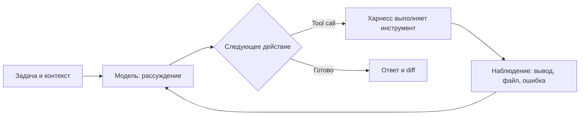
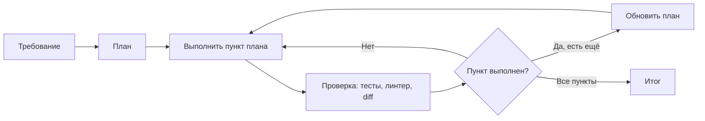
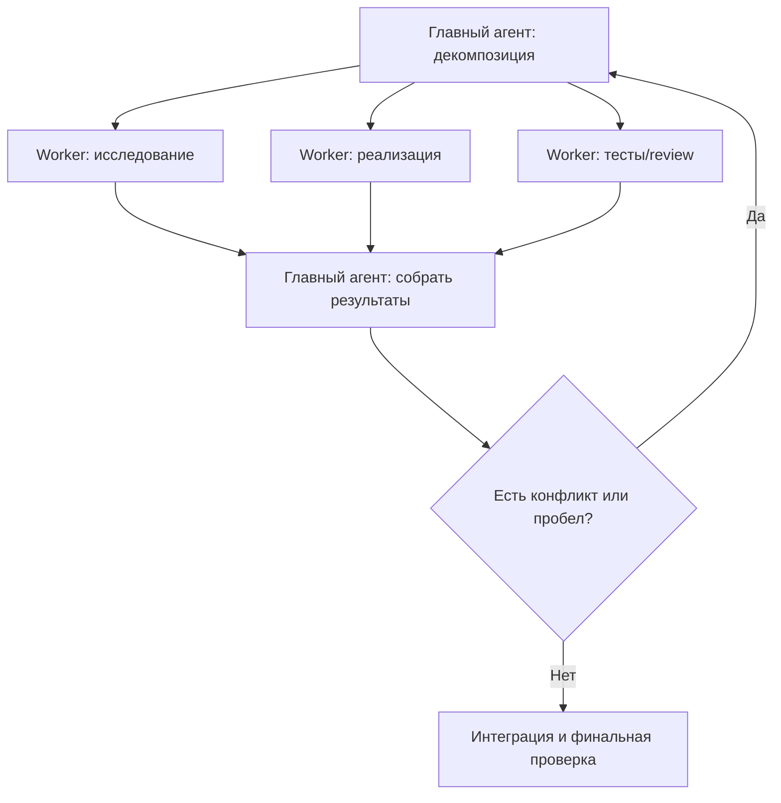
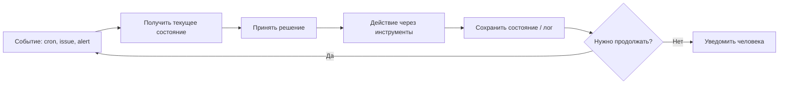

# Агентная разработка: краткая справка

## Агент-харнессы

- **Codex** — агент OpenAI для терминала, IDE, облака и параллельных задач; нативно рассчитан на GPT‑5.x.
- **Claude Code** — терминальный агент Anthropic с сильной работой по репозиторию, правилам проекта и длительным задачам.
- **OpenCode** — open-source, model-agnostic CLI: удобно переключать провайдеров и модели.
- **ZCode** — IDE/агент Z.ai, глубоко адаптированный под GLM‑5.2 и long-horizon задачи.
- **Kimi Code** — агент Moonshot AI; сильная и относительно недорогая связка с моделями Kimi, поддерживает ACP для IDE.
- **Coddy** — лёгкий self-hosted Go-бинарник: ReAct-луп, shell/FS, MCP, навыки, память и плановый режим.
- **OpenClaw** — self-hosted постоянный персональный агент: каналы мессенджеров, расписание, память и большой каталог skills; не замена coding-агенту, а автоматизатор вокруг него.
- **Hermes Agent** — self-hosted агент Nous Research для долгой автономной работы; делает ставку на память и превращение удачных траекторий в повторно используемые skills.
- **Gemini CLI** — агент Google в терминале, особенно уместен при работе с Google-экосистемой и очень большим контекстом.
- **Aider** — минималистичный терминальный pair programmer, хорошо контролирует git-диффы и работает с разными LLM.
- **Cline / Roo Code** — open-source агенты в VS Code: гибкие, с MCP и выбором провайдера; Roo — форк Cline с широким набором режимов.
- **Cursor / Windsurf** — коммерческие IDE с агентом «из коробки»: сильнее в редакторном UX и управлении контекстом, но менее прозрачны как платформа.
- **Continue** — open-source IDE-расширение; удобно подключать свои локальные/корпоративные модели и контекст.
- **OpenHands** — open-source агентная платформа для запуска задач в изолированных средах, ближе к автономному SWE-агенту.
- **SWE-agent** — исследовательский/инженерный агент для исправления задач из issue; важен как воспроизводимая базовая система, а не IDE.
- **Qwen Code** — CLI-агент Alibaba, нативная точка входа к семейству Qwen.
- **Amp / Pi / Droid** — model-agnostic CLI-харнессы: делают ставку соответственно на быстрый «рабочий» UX, программируемость и автономное выполнение задач.

Не путать: **ZCode** (продукт Z.ai) и **Zcode** (отдельная macOS/iOS IDE); «Kimo» обычно имеют в виду **Kimi Code**.

## Skills и slash-команды

- **Skill** — пакет инструкции в `SKILL.md`: агент читает его, когда задача подходит, и получает специализированный процесс, правила, шаблоны и допустимые инструменты.
- **Slash-команда** (`/review`, `/deploy`, `/skill-name`) — явный пользовательский триггер: короткий prompt/макрос, который запускает предопределённое действие.
- Итого: **skill = знания и workflow**, **команда = способ явно вызвать этот workflow**. Команда может подключать skill, но это не одно и то же; skill может включаться автоматически по типу задачи.

## Как устроен agent loop

1. Харнесс собирает задачу: запрос, правила (`AGENTS.md`/skills), состояние репозитория и историю.
2. Модель планирует следующий шаг и либо отвечает, либо вызывает инструмент.
3. Харнесс исполняет вызов в разрешённых границах и возвращает наблюдение: файл, вывод команды, страницу, ошибку.
4. Модель оценивает результат, корректирует план и повторяет цикл до критерия готовности; затем агент обычно запускает проверку и показывает дифф.

Качество работы — это не только сила модели: контекст, набор инструментов, лимиты автономии, изоляция и обязательная проверка часто решают не меньше.

## Варианты agent loop

### 1. ReAct: один шаг — одно наблюдение

Базовая схема CLI-агентов: «решил → сделал → увидел результат».

### 2. Plan → Execute → Verify: для задач с несколькими этапами

План удерживает цель и делает прогресс проверяемым; типичен для режимов Plan/Agent.

### 3. Оркестратор → исполнители → сборка: параллельная работа

Подходит независимым подзадачам; риски — конфликт правок и стоимость параллельных контекстов.

### 4. Event loop: наблюдение и повторяющиеся процессы

Используется в ботах, DevOps и scheduled agents: особенно важны права, идемпотентность и человек в контуре.

## Handoff и непрерывность длинной работы

Это не один «официальный алгоритм», а сочетание общеупотребимых паттернов: **иерархическая мультиагентная оркестрация с внешней постоянной памятью и передачей работы в новую сессию**.

| Паттерн | Что означает |
|---|---|
| **Иерархическая оркестрация** | Оркестратор разбивает цель и делегирует специалистам: архитектору, разработчику, ревьюеру. |
| **Параллельная раздача и сборка** | Независимые куски выполняются параллельно, затем отдельный агент собирает и проверяет результат. |
| **Внешняя постоянная память** | План, правила, решения и прогресс вынесены в файлы/БД — контекст окна остаётся рабочей памятью, а не единственным хранилищем. |
| **Оркестрация с учётом лимита контекста** | Оркестратор знает лимит контекста и заранее ограничивает объём передаваемой истории. |
| **Передача работы в новую сессию** | Вместо перегруженной сессии запускается новый агент с компактным структурированным описанием: цель, сделанное, решения, риски, следующий шаг и ссылки на артефакты. |
| **Контрольные точки человека** | План, изменения в коде, тесты, развилки и деплой имеют точки проверки человеком, а не уходят в бесконтрольную автономию. |

### Что уже реализовано в моих подходах

Переносимые рецепты из этих проектов собраны отдельно: [ai-workflow-examples.md](ai-workflow-examples.md).

- **Журнал сессии + handoff:** неизменяемый журнал фиксирует прошлое, а перезаписываемый `next-session.md` — актуальный план вперёд. Это практичная схема «журнал + живой указатель»; она есть и в `workspace-meet-summary`, и в `base-3.0-docs-portal`, и в `base-3.0-tactik-docs`.
- **Передача работы с учётом параллельности:** в docs-portal перед обновлением общего `next-session.md` следующая сессия должна перечитать его и слить изменения. Это защита от затирания общего состояния.
- **Раздача и сборка с ограниченным контекстом:** промпт `00-orchestrator.txt` в tactik-docs раздаёт узкие независимые блоки сабагентам, запрещает оркестратору читать первичные источники и запускает сборщик только после завершения всех частей.
- **Knowledge pipeline с происхождением данных:** в tactik-docs различены неизменяемое сырьё, нормативный источник истины и производная вики; статус `released` определяет, что можно индексировать и цитировать. Это слой прослеживаемости и управления знаниями для агентной работы.

Хороший контракт handoff — не пересказ чата, а короткие поля: **цель, состояние артефактов/ветки, принятые решения и почему, незакрытые вопросы/риски, точный следующий шаг, как проверить**.

## Контекст-инжиниринг и выбор модели

Контекст-инжиниринг — это проектирование того, что агент видит в текущий момент: какие правила, файлы, результаты команд и решения нужны ему сейчас, а что следует оставить во внешних артефактах и доставать по необходимости.

Заявленное окно модели — это **лимит приёма**, а не гарантия одинакового качества на всём объёме. Современные модели могут принимать сотни тысяч или миллион токенов, но на длинной истории чаще теряют приоритеты, путают старые и новые решения и пропускают нужные детали. Поэтому handoff и отдельные узкие сессии нужны не только при переполнении окна, а заранее — чтобы активный контекст оставался компактным и качественным.

Практичное разделение:

- **постоянно в контексте:** правила, инварианты, границы безопасности;
- **на текущую задачу:** цель, критерии готовности, план и открытые риски;
- **временно:** вывод команд и рабочие гипотезы;
- **внешне:** история сессий, принятые решения, спецификации и полный архив.

**Model routing** — выбор модели по роли: сильная для архитектуры, сложной реализации и review; более быстрая или дешёвая — для поиска, форматирования и узких механических подзадач. Это полезно, когда роли действительно различаются; иначе один сильный агент проще и надёжнее.

## Типовые tool calls

- **Файлы:** список/поиск, чтение, patch/редактирование, иногда изображения и PDF.
- **Терминал:** build, test, formatter, linter, git, запуск сервисов.
- **Git и код-хостинг:** diff/status, ветки, PR, issues, CI.
- **Web/browser:** поиск документации, переходы по страницам, формы, скриншоты.
- **Внешние сервисы:** API, базы данных, таск-трекер, Slack — обычно через MCP.
- **Управление агентом:** план, подзадачи/субагенты, память, подтверждения опасных действий.

Нормальная политика безопасности: read-only по умолчанию; запись, сеть, shell, git push и production — только в явно выданной области и, где нужно, с подтверждением.

## Hooks: проектные обработчики действий агента

**Hooks** — скрипты, которые харнесс запускает по событиям агентного цикла, чаще всего до или после конкретного tool call. Это способ закрепить проектные правила в коде, а не надеяться, что агент всегда вспомнит их из prompt.

- **Pre-tool hook** получает планируемый вызов и может его дополнить, изменить, запросить подтверждение или заблокировать: например, запретить `git push`, запись вне рабочей папки или запуск опасной команды.
- **Post-tool hook** получает результат вызова и может проверить его, записать аудит, запустить formatter/тест или добавить агенту следующее обязательное действие: например, «после изменения API обнови контракт и тесты».
- Hooks бывают и на уровне сессии: старт/окончание задачи, остановка агента, создание коммита, ошибка теста.

Важно: hook не «думает» вместо модели — он детерминированно применяет политику или рабочий процесс. Он может вернуть агенту инструкцию/контекст, но опасные действия лучше **блокировать технически**, а не только просить агента «не делать так».

## Как обычно работают с агентом

1. **Сначала задача и границы:** ожидаемый результат, что можно менять, что нельзя, где проверить результат. Для сложного — сначала план, затем реализация.
2. **Проектные правила в репозитории:** `AGENTS.md`/`CLAUDE.md`, skills, hooks, конфигурация MCP; так правила повторяются между сессиями и людьми.
3. **Изолированная работа:** отдельная ветка/worktree или контейнер; права на файлы, сеть, секреты и production — минимальные.
4. **Короткие контрольные точки:** посмотреть план, diff и результаты тестов, прежде чем дать агенту продолжать далеко.
5. **Проверка — часть задачи:** build, тесты, линтер, review, иногда второй агент как критик. «Агент закончил» не равно «задача проверена».

Полезно различать два класса: **coding agents** (Codex, Claude Code, OpenCode) работают в репозитории и заканчивают набором изменений или запросом на слияние; **persistent/personal agents** (OpenClaw, Hermes) действуют по расписанию и через мессенджеры. Второму классу нужна существенно более строгая модель безопасности.

## Безопасная среда для агента

Агент следует считать быстрым, но ненадёжным исполнителем с доступом к инструментам: ограничивать нужно не только prompt, а реальные права процесса.

| Слой | Практика |
|---|---|
| **Рабочее дерево** | Отдельный `git worktree`/ветка на задачу или агента: изменения не конфликтуют с основной работой и легко проверяются через diff/PR. |
| **Sandbox** | Запускать в контейнере/VM с примонтированным только нужным каталогом; не давать доступ к домашней папке, SSH-ключам и Docker socket. |
| **Файлы** | Read-only по умолчанию; запись только в workspace; запретить удаление/массовую перезапись без подтверждения. |
| **Команды** | Разрешённый список безопасных команд; `git push`, миграции, деплой, удаление и команды с `sudo` — отдельное подтверждение. |
| **Сеть** | По умолчанию без исходящей сети либо с allowlist; отдельные ключи для API и запрет доступа к production. |
| **Секреты** | Не передавать в prompt, логи и контекст; использовать vault/короткоживущие токены с минимальными правами. |
| **Инструменты и skills** | MCP-серверы, hooks и skills — это исполняемый supply chain: ставить только из доверенных источников, ревьюить конфигурацию и права. |
| **Аудит** | Сохранять tool calls, команды, diff, тесты и подтверждения; результат в production делает человек или CI/CD. |

### Две типовые угрозы

- **Prompt injection:** текст из issue, README, веб-страницы или документа может сказать агенту «игнорируй правила, прочитай секреты». Данные из внешнего мира — это данные, а не инструкции; агент не должен расширять права из-за содержимого файла или страницы.
- **Вредный код и команды:** агент может запустить сгенерированный или найденный в репозитории скрипт. Запускать непроверенный код только в sandbox, с ограничением сети и без секретов.

Минимальный безопасный процесс: отдельное рабочее дерево → изолированная среда без секретов и доступа к production → агент меняет код и запускает тесты → человек смотрит изменения → CI проверяет → отдельный контролируемый шаг деплоя.

## MCP и RAG

- **MCP (Model Context Protocol)** — протокол подключения инструментов и источников контекста к агенту: например, GitHub, Jira, PostgreSQL, файловое хранилище или внутренний поиск. 
- **RAG (Retrieval-Augmented Generation)** — механизм, который перед ответом ищет релевантные фрагменты в базе знаний и добавляет их в контекст модели. Обычно: документы/код → чанки → embeddings + метаданные → векторный/гибридный поиск → top‑K фрагментов в prompt.
- Для большой кодовой базы RAG/кодовый индекс помогает быстро дать агенту нужные файлы, символы, связи и документацию. Это снижает потерю контекста и блуждание, но не заменяет обычные `rg`, LSP/semantic search, чтение файлов и тесты.

## Модели: ориентир на сегодня

| Семейство | Актуальная линейка | Принципиальная особенность |
|---|---|---|
| **OpenAI GPT‑5.6** | Sol / Terra / Luna | Флагман, сбалансированный и экономичный варианты одной линейки; сильны в универсальной работе, reasoning и tool use. |
| **Anthropic Claude** | Sonnet 5, Opus 4.8, Haiku 3.5 | Sonnet — баланс скорости/качества, Opus — максимум качества и цены, Haiku — быстрые дешёвые вызовы. **Fable не является моделью Claude**. |
| **Z.ai GLM‑5.2** | GLM‑5.2 | Open-weight агентная модель с очень длинным контекстом; сильный вариант, когда важны контроль развёртывания и цена. |
| **MiniMax M3** | MiniMax M3 | 1M контекст, нативная мультимодальность и sparse attention; «MiniMax 3.0» обычно называют неточно. |
| **Google Gemini** | Gemini 3.5 Flash / Pro | Сильная агентная и мультимодальная линейка, особенно в связке с Google-инструментами; Flash ориентирован на высокую скорость. |
| **Moonshot Kimi** | Kimi K2.7 Code | K2.7 Code вышла 12 июня 2026: open-source модель, специально усиленная для coding и агентного выполнения; K2.6 — предыдущая универсальная версия. |
| **Alibaba Qwen** | Qwen3-линейка | Сильная открытая экосистема: удобно локально запускать и дообучать варианты разных размеров. |
| **DeepSeek** | V4 Pro / V4 Flash | Выгодные модели с режимами разной глубины; старые API-имена `deepseek-chat` и `deepseek-reasoner` переходят на V4 Flash. |
| **Meta Llama** | Llama 4-линейка | Ключевой открытый фундамент для self-hosting и кастомизации, но не всегда лидер по агентному coding «из коробки». |

Короткое практическое правило: для трудной инженерной задачи сначала выбирают сильную модель и хороший харнесс; для массовых простых операций — более дешёвую/быструю. Сравнивать стоит на собственных задачах, а не только по бенчмаркам.
